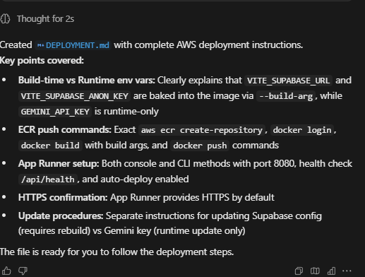

# AWS Deployment Guide for VibeMatch

This guide covers deploying the VibeMatch Docker container to AWS using Amazon ECR and App Runner.

## Important: Environment Variables

**⚠️ Critical Distinction: Build-time vs Runtime Environment Variables**

This project uses two types of environment variables:

### 1. Build-time Variables (Vite Frontend)
- `VITE_SUPABASE_URL`
- `VITE_SUPABASE_ANON_KEY`

These are **baked into the Docker image at build time** via the Vite build process. They are embedded in the compiled JavaScript bundle and **cannot be changed at runtime**.

**Current Handling:** The Dockerfile accepts these as `--build-arg` values during `docker build`. You must provide them when building the image.

### 2. Runtime Variables (Express Server)
- `GEMINI_API_KEY`

These are read by the Express server at container startup and **can be changed at runtime** without rebuilding the image.

**Current Handling:** These are passed via `--env-file` or `-e` flags when running the container, and configured in App Runner's environment variables section.

---

## Step 1: Push Docker Image to Amazon ECR

### 1.1 Create an ECR Repository

```bash
# Replace with your AWS account ID and region
AWS_ACCOUNT_ID="123456789012"
AWS_REGION="us-east-1"
REPO_NAME="vibematch"

aws ecr create-repository \
  --repository-name ${REPO_NAME} \
  --region ${AWS_REGION}
```

### 1.2 Authenticate Docker with ECR

```bash
aws ecr get-login-password --region ${AWS_REGION} | \
  docker login --username AWS --password-stdin ${AWS_ACCOUNT_ID}.dkr.ecr.${AWS_REGION}.amazonaws.com
```

### 1.3 Build the Docker Image with Build Arguments

**⚠️ You must provide your Supabase credentials as build arguments:**

```bash
# Get these from your project's .env file
VITE_SUPABASE_URL="https://your-project.supabase.co"
VITE_SUPABASE_ANON_KEY="your-anon-key-here"

docker build \
  -t vibematch:latest \
  -t ${AWS_ACCOUNT_ID}.dkr.ecr.${AWS_REGION}.amazonaws.com/${REPO_NAME}:latest \
  --build-arg VITE_SUPABASE_URL=${VITE_SUPABASE_URL} \
  --build-arg VITE_SUPABASE_ANON_KEY=${VITE_SUPABASE_ANON_KEY} \
  .
```

### 1.4 Tag and Push to ECR

```bash
docker push ${AWS_ACCOUNT_ID}.dkr.ecr.${AWS_REGION}.amazonaws.com/${REPO_NAME}:latest
```

---

## Step 2: Create AWS App Runner Service

### Option A: Using AWS Console (Recommended for First Deployment)

1. **Navigate to App Runner**
   - Go to AWS Console → App Runner → "Create service"

2. **Source Configuration**
   - Select "Container image"
   - Container image URI: `${AWS_ACCOUNT_ID}.dkr.ecr.${AWS_REGION}.amazonaws.com/${REPO_NAME}:latest`
   - Platform: Linux
   - CPU: 1 vCPU (or 2 vCPU for better performance)
   - Memory: 2 GB (or 4 GB for better performance)

3. **Deployment Settings**
   - Auto-deployments: ✅ Enabled (automatically deploys new image pushes)
   - Deployment trigger: Automatic

4. **Configuration**
   - Port: `8080`
   - Environment variables:
     ```
     GEMINI_API_KEY=your-gemini-api-key-here
     ```
   - **Note:** Do NOT set `VITE_SUPABASE_URL` or `VITE_SUPABASE_ANON_KEY` here — they are already baked into the image from the build step.

5. **Health Check**
   - Health check path: `/api/health`
   - Protocol: HTTP
   - Interval: 30 seconds
   - Timeout: 5 seconds
   - Healthy threshold: 1
   - Unhealthy threshold: 5

6. **Security**
   - IAM role: Create new service role (App Runner will create this automatically)
   - Access: Public

7. **Review and Create**
   - Service name: `vibematch`
   - Click "Create service"

### Option B: Using AWS CLI

```bash
# Create App Runner service
aws apprunner create-service \
  --service-name vibematch \
  --source-configuration '{
    "ImageRepository": {
      "ImageIdentifier": "'${AWS_ACCOUNT_ID}'.dkr.ecr.'${AWS_REGION}'.amazonaws.com/'${REPO_NAME}':latest",
      "ImageConfiguration": {
        "Port": "8080",
        "EnvironmentVariables": [
          {
            "Name": "GEMINI_API_KEY",
            "Value": "your-gemini-api-key-here"
          }
        ]
      },
      "AutoDeploymentsEnabled": true
    }
  }' \
  --instance-configuration '{
    "Cpu": "1 vCPU",
    "Memory": "2 GB"
  }' \
  --health-check-configuration '{
    "Protocol": "HTTP",
    "Path": "/api/health",
    "Interval": 30,
    "Timeout": 5,
    "HealthyThreshold": 1,
    "UnhealthyThreshold": 5
  }' \
  --region ${AWS_REGION}
```

---

## Step 3: Verify Deployment

1. **Check Service Status**
   - In App Runner console, wait for service status to show "Running"
   - This typically takes 2-5 minutes

2. **Get the Service URL**
   - App Runner provides a default domain like: `https://xxxxxxxxxx.us-east-1.awsapprunner.com`
   - This is **HTTPS by default** — no additional SSL configuration needed

3. **Test Endpoints**
   - Frontend: `https://your-service-url.awsapprunner.com`
   - Health check: `https://your-service-url.awsapprunner.com/api/health`
   - Chat endpoint: `https://your-service-url.awsapprunner.com/api/chat`

---

## Updating the Application

### To Update Supabase Configuration (Requires Rebuild)

Since `VITE_SUPABASE_URL` and `VITE_SUPABASE_ANON_KEY` are baked into the image:

1. Rebuild with new build arguments:
   ```bash
   docker build \
     -t vibematch:latest \
     -t ${AWS_ACCOUNT_ID}.dkr.ecr.${AWS_REGION}.amazonaws.com/${REPO_NAME}:latest \
     --build-arg VITE_SUPABASE_URL=${NEW_SUPABASE_URL} \
     --build-arg VITE_SUPABASE_ANON_KEY=${NEW_SUPABASE_ANON_KEY} \
     .
   ```

2. Push to ECR:
   ```bash
   docker push ${AWS_ACCOUNT_ID}.dkr.ecr.${AWS_REGION}.amazonaws.com/${REPO_NAME}:latest
   ```

3. App Runner will auto-deploy (if auto-deploy is enabled)

### To Update GEMINI_API_KEY (No Rebuild Needed)

Since `GEMINI_API_KEY` is a runtime variable:

1. Go to App Runner console → vibematch service → Configuration
2. Edit environment variables
3. Update `GEMINI_API_KEY`
4. Save and redeploy

---

## Troubleshooting

### Build Fails with "supabaseUrl is required"
- Ensure you're passing `--build-arg VITE_SUPABASE_URL` and `VITE_SUPABASE_ANON_KEY` during docker build
- Check that the values are correct (no extra spaces, quotes, etc.)

### Container Starts But Frontend Shows Errors
- Verify the build arguments were passed correctly
- Check browser console for Supabase connection errors
- Ensure Supabase project is active and accessible

### API Returns 500 Errors
- Check App Runner logs for detailed error messages
- Verify `GEMINI_API_KEY` is set correctly in App Runner environment variables
- Ensure the Gemini API key is valid and has quota available

### Health Check Fails
- Verify the health check path is `/api/health`
- Check App Runner logs for startup errors
- Ensure the container is listening on port 8080

---

## Cost Considerations

- **App Runner:** ~$0.007/hour for 1 vCPU + 2 GB (Linux) ≈ $5/month if running 24/7
- **ECR:** $0.10/GB/month for storage (minimal for this app)
- **Data Transfer:** Free tier includes 100 GB/month outbound

Consider enabling auto-scaling or using a smaller instance size for development to reduce costs.
